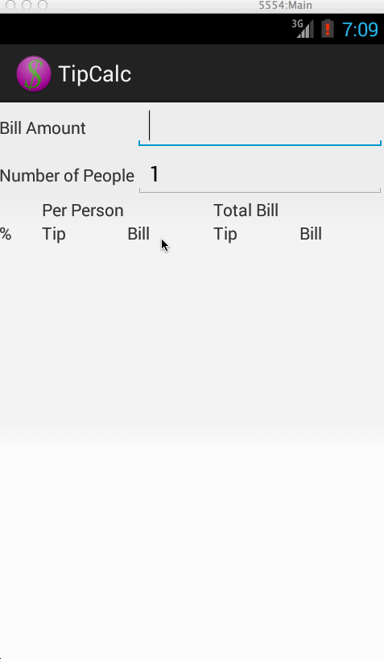

# Week 1 Project:  Tip Calculator

This is a basic tip calculator.

Time spent:  12 hours total.

Completed user stories:

 * [x] Required: User is displayed the tip of specified percentage for specified entered amount
 * [x] Required: User enters the total amount of the transaction
 * [x] Required: User can select between tip amounts (i.e 10%, 15%, 20%)
 * [x] Required: Upon selecting tip amount, formatted tip value is displayed
 * [x] Optional: User changes the total amount and updated tip is reflected automatically
 * [x] Optional: User can select custom tip percentage if desired
 * [x] Optional: User can select how many ways to split the tip
 * [ ] Optional: User can edit preset tip percentages and have them persist across launches
 * [x] Optional: Experiment with trying input widgets to replace the buttons and/or textviews
 * [ ] Optional: Improve the user interface and experience by using images and/or colors

Release Notes:

TipCalc generates a table of tip percentages.  I found this
a better user experience than entering an exact percentage.  I rarely tip 
EXACTLY 15%.  Instead, I round the total amount based on the cash in my 
pocket (i.e. $20 bills) or to the nearest dollar amount.  Being able to 
quickly guesstimate the tip in the right ballpark is valuable to me.

Implementation Notes:

Decided to change the dollar sign icon after initial project creation.  Wasn't
as bad as I thought it would be.

Added gesture detection to allow user to increment / decrement number of people
to split the bill by swiping left/right.

Spent time trying the number picker widget, but couldn't get it to work
properly.  Arrows never showed up in the emulator nor on a real device.
Decided to punt this and use gesture + EditText for number of people.

Tried changing the layout to add some margins to the border of the screen, but
that totally messed things up.  Decided to revert and live with a crappy UI.

Wrestled a lot with graphical layout.  Decided to edit XML directly to get the
layout elements that I wanted.

Todo:

* Add margin to the outline of parent.  Text is bumping against borders
* Center the "Per Person" and "Total Bill" text views 
* Right justify columns with dollar amounts
* Highlight rows for 15% and 20% to show standard tips - requires multiple textviews to highlight different rows, or perhaps a table layout
* Add images and UI "magic" to make the app look better.
* Allow user to input location name.  Save location + bill amount in a persistent database so user can download to Google sheet
* Deal with corner cases involving large bills amounts (greater than $800k), or large numbers of people (i.e. 1000 people splitting a small bill might show 0 tip)

Walkthrough of all user stories:

